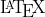

Hi, I'm Wendi!

<!--

# 👋 Hello there,

## About Me

- 🎓 5th year Mechatronics Engineering (Hons) and Mathematics student at the University of Queensland
- 🤖 Passionate about computer vision and deep learning research
- 😤 Still trying to get my engineering mates to actually use   

##  Stuff
- ✅ Cool things I've done
    - Working on Vision Transformers for my Honours thesis   
    - ☀ Created solar & battery system data models while interning at [Redback Technologies](https://redbacktech.com/)
    - 🧠 Worked on MRI image reconstruction for a research project. Explored some cool things like complex-valued neural networks, dilated CNNs and 2D Fourier Transforms
    - 👨‍🏫 Tutored 1st year uni classes for calculus, linear algebra and MATLAB
    - ✒ Was a tech journalist in high school! Helped found TechFlow Media Group with some friends and later wrote for Tom's Hardware too
- ⬛ Cool things I want to do
    - Get into a leading research lab for my PhD

## Get in touch
- Email
`wendi.ma@uqconnect.edu.au`

-->

<!--

**imwendi/imwendi** is a ✨ _special_ ✨ repository because its `README.md` (this file) appears on your GitHub profile.

Here are some ideas to get you started:
- 🔭 I’m currently working on ...
- 🌱 I’m currently learning ...
- 👯 I’m looking to collaborate on ...
- 🤔 I’m looking for help with ...
- 💬 Ask me about ...
- 📫 How to reach me: ...
- 😄 Pronouns: ...
- ⚡ Fun fact: ...
-->
